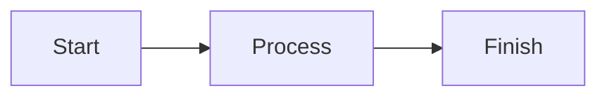

# Inline charts

Lyra renders charts inside Markdown answers using bundled, offline libraries: Mermaid 11.17.2 and Apache ECharts 6.1.0. The `create_chart` tool is available to OpenAI-compatible, Responses, Anthropic and Gemini agents through the shared tool schema. It can be disabled under Settings > Agent tools. It requires no image-generation model.

The tool accepts `engine` (`mermaid` or `echarts`), `source`, and an optional `title`. Its result contains `markdown`; the agent inserts that value verbatim wherever the chart belongs in its answer. The chart source remains in the conversation, so reopening history renders the same chart without a network connection.

| Chart | Engine / syntax |
| --- | --- |
| Flowchart / architecture | Mermaid `flowchart` with optional `subgraph`, or `architecture-beta` |
| Sequence diagram | Mermaid `sequenceDiagram` |
| Gantt chart | Mermaid `gantt` |
| Mind map | Mermaid `mindmap` |
| Entity relationship / class / state diagram | Mermaid `erDiagram`, `classDiagram`, `stateDiagram-v2` |
| Line / bar / pie chart | ECharts JSON option with `line`, `bar`, or `pie` series |
| Relationship graph / tree | ECharts `graph` or `tree` series |

Direct `mermaid` and `echarts` fenced blocks are also rendered. For example:

````markdown


```echarts
{"xAxis":{"type":"category","data":["Jan","Feb","Mar"]},"yAxis":{"type":"value"},"series":[{"type":"bar","data":[12,18,15]}]}
```
````

Each card has source-copy, source-view, save and fullscreen controls. Inline previews automatically fit the entire chart within the card width and a compact height of at most 240 dp. Source scrolling does not reveal conversation navigation controls. Fullscreen supports scrolling and pinch zoom, with space reserved for system bars and the bottom gesture area. Save opens Android's file picker, with PNG, standalone SVG, and editable source (`.mmd` or `.json`) options. PNG exports use up to 2× resolution, capped at 4096 pixels per side and 16 million pixels total. Rendering errors are shown in the card while the original source stays available to copy and inspect. Incomplete streamed fences remain code until their closing fence arrives.

ECharts source must be a JSON option object, including series types and data; executable callbacks, custom render functions, external images and remote fonts are unsupported. Mermaid source must start with a diagram header and omit configuration directives and YAML frontmatter; use the tool's title field instead. Source is limited to 100,000 characters, Mermaid graphs to 500 edges, and ECharts to 100 series. Mermaid runs in strict mode with HTML labels disabled, and ECharts tooltips use text rendering. A private WebView origin serves only the three bundled chart scripts; file, content, navigation and network access are blocked.

Bundled assets and original license notices live in `app/src/main/assets/charts`. For upgrades, retrieve the pinned npm tarballs, copy the minified distributable and licenses, update versions/hashes in `charts/README.md`, and run `ChartDocumentTest` plus `ChartRenderingInstrumentedTest`.
